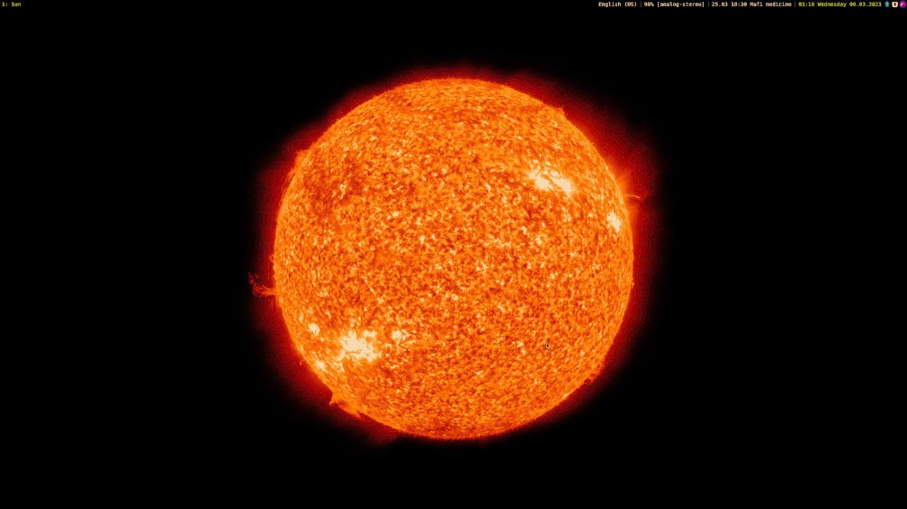

+++
title = "Stable Diffusion XL banners replaced with Flux Dev banners"
date = 2024-08-18
slug = "sdxl-banners-replaced-with-fluxd-banners"

[extra]
banner = "banner-sd-flux.png"
bannerAlt = "Mœbius comics style. Post-apocalyptic frozen river with abandoned military ships, smoking ruins in the background. Dominated with white snow blizzard. Flakes visible."

[taxonomies]
tags = ["nixos","nix-flakes"]
+++

Comparison of my posts' previous banners generated with Stable Diffusion XL with
new ones generated with Flux Dev.

<!-- more -->
<!-- TOC -->

## Opinion about SDXL and Flux

Flux is definetely smarter. The images are crisp and without deformed gibberish.
And it thoroughly follows the instructions. At this point it actually disapoints
me. Although SDXL images were inperfect, there was something deeper in the
expression of the scene. Or maybe that is just because I used Mœbius Lora.

Flux is still relatively fresh, and the Lora creators are just starting, so
maybe the genius spark ignition is about to come. Anyway, for your enjoynment,
here is the comparison of old and new banners.

## Banner - Don Juan's dream

Both came out great, but SDXL despite the lower quality has the Mœbius sketch.

{{ resize_image_w(path="20240818-ai-generated-banners/sd-banners/banner-ai-generated-images.png", width=748) }}

{{ resize_image_w(path="20240818-ai-generated-banners/flux-banners/banner-ai-generated-images.png", width=748) }}

## Banner - Thin clients spaceship revival

The SDXL settings is more cozy, but the Flux is really symmetric and detailed.
Even the sceen content looks normal.

{{ resize_image_w(path="20240818-ai-generated-banners/sd-banners/banner-display-manager.png", width=748) }}

{{ resize_image_w(path="20240818-ai-generated-banners/flux-banners/banner-display-manager.png", width=748) }}

## Banner - Haumea - the Hawaian goddess of rebirth

Here Flux made the dream image on the first try.

{{ resize_image_w(path="20240818-ai-generated-banners/sd-banners/banner-haumea-cheatsheet.png", width=748) }}

{{ resize_image_w(path="20240818-ai-generated-banners/flux-banners/banner-haumea-cheatsheet.png", width=748) }}

## Banner - Intergalactic hive

Original SD with Hive's logo added in Gimp.

{{ resize_image_w(path="20240818-ai-generated-banners/first-banners/hive.png", width=748) }}

This concept was too funky for both SDXL and Flux.

{{ resize_image_w(path="20240818-ai-generated-banners/sd-banners/banner-hive.png", width=748) }}

{{ resize_image_w(path="20240818-ai-generated-banners/flux-banners/banner-hive.png", width=748) }}

## Banner - Cozy cabbing listening to the deep universe

Here Flux won the whole round. It was really hard to get the desired result from
the SD.

{{ resize_image_w(path="20240818-ai-generated-banners/sd-banners/banner-homeserver.png", width=748) }}

{{ resize_image_w(path="20240818-ai-generated-banners/flux-banners/banner-homeserver.png", width=748) }}

## Banner - Galaxy

First banner. Not generated, just a patched GIF image.

  

Again Flux better following the instructions. SDXL is a nonsense hallucination.

{{ resize_image_w(path="20240818-ai-generated-banners/sd-banners/banner-i3-solar-workspaces.png", width=748) }}

{{ resize_image_w(path="20240818-ai-generated-banners/flux-banners/banner-i3-solar-workspaces.png", width=748) }}

## Banner - Winter flakes freezing ships in the channel

Flux is more consistent, but the SD Mœbius composition is better.

{{ resize_image_w(path="20240818-ai-generated-banners/sd-banners/banner-nix-shell-custom-channel.png", width=748) }}

{{ resize_image_w(path="20240818-ai-generated-banners/flux-banners/banner-nix-shell-custom-channel.png", width=748) }}

## Banner - Tired Paisano riding donkey in abandoned desert

I was not able to reproduce that "tired bounty hounter" look.

{{ resize_image_w(path="20240818-ai-generated-banners/sd-banners/banner-paisano-cheatsheet.png", width=748) }}

{{ resize_image_w(path="20240818-ai-generated-banners/flux-banners/banner-paisano-cheatsheet.png", width=748) }}

## Banner - Zombie apocalypse

SDXL with Mœbius Lora generated really atmoshperic sceneries. For Flux I had to
be very specific what I want to achieve. At the end I have steered to the joke
of zombie still programming.

{{ resize_image_w(path="20240818-ai-generated-banners/sd-banners/banner-pz-nixos.png", width=748) }}

{{ resize_image_w(path="20240818-ai-generated-banners/flux-banners/banner-pz-nixos.png", width=748) }}

## Banner - Well organized white rabbit from Alice in the Wonderland

SDXL with Mœbius Lora generated really atmoshperic sceneries. For Flux I had to
be very specific what I want to achieve. At the end I have steered to the joke
of zombie still programming.

{{ resize_image_w(path="20240818-ai-generated-banners/sd-banners/banner-time-tracking.png", width=748) }}

{{ resize_image_w(path="20240818-ai-generated-banners/flux-banners/banner-time-tracking.png", width=748) }}

## Banner - Neovim matrix and it's pimp up

Here are the Neovim banners. The Flux is missing because when I tried to enable
ControlNet with it, it was throwing an error. So instead here is comparison of
origina SD + Gimp with the SDXL + ControlNet.

Neovim post:

{{ resize_image_w(path="20240818-ai-generated-banners/first-banners/neovim-banner.png", width=748) }}

{{ resize_image_w(path="20240818-ai-generated-banners/sd-banners/banner-neovim-flake.png", width=748) }}

Update post:

{{ resize_image_w(path="20240818-ai-generated-banners/first-banners/neovim-update.png", width=748) }}

{{ resize_image_w(path="20240818-ai-generated-banners/sd-banners/banner-neovim-flake-update.png", width=748) }}

